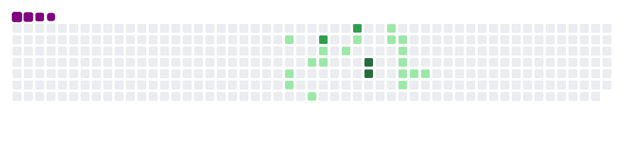

<h1 align="center">

</h1>

> Hello! My name is Marcus | Mark | MK and I am Christian and currently in the second year of the Analysis and Systems Development course at DESCOMPLICA college. I am passionate about technology, especially fascinated by the front-end area. I have been tirelessly dedicated to improving my skills and carving out my space in the job market.

> My journey is driven by a constant desire to learn and the determination to tackle real-world challenges. Although I sometimes encounter moments of frustration when I perceive that progress is not as fast as I would like, I find in those moments an extra motivation to persist and pursue my dream with even more dedication.

> I am eager for the opportunity to apply my knowledge and skills in a professional environment, making a significant contribution and learning from every challenge I face. I firmly believe that, with dedication and faith, I will achieve my goals. I am grateful for the opportunity and I hope that God continues to guide me on this journey.

##

- 🌱 I’m currently learning about React/NextJs/TypeScript
- 👯 I’m looking a job (I hope remove this line soon)
- 💬 Ask me about anything!
- 📫 How to reach me: My instagram or Linkdin
- ⚡ Fun fact: I love pudim | I'm a funny guy | I love make friend

##

  <h1 align="center">My github stats</h1>

##

 
  
  
  
   
  

##
<picture>
  <source media="(prefers-color-scheme: dark)" srcset="github-snake-dark.svg" />
  <source media="(prefers-color-scheme: light)" srcset="github-snake.svg" />
  
</picture>

